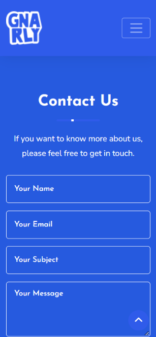
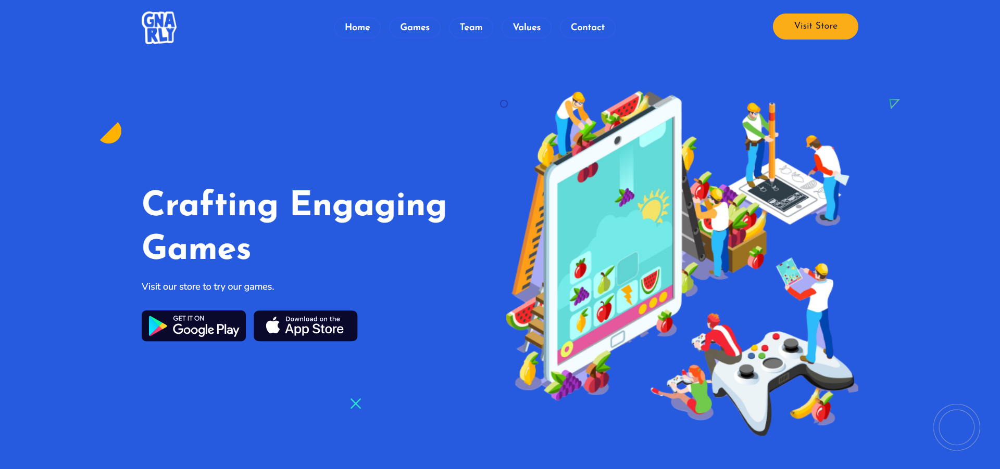

# Mobile first landing page of Gnarly Game Studio 

https://www.gnarlygamestudio.com

## Setup

This is a static web site and does not require a setup.

## Serve

Clicking on the `index.html` will most likely do it.

You may also consider using a static page server such as `livereload` in order to serve the web page on local.

   
   
   
   

